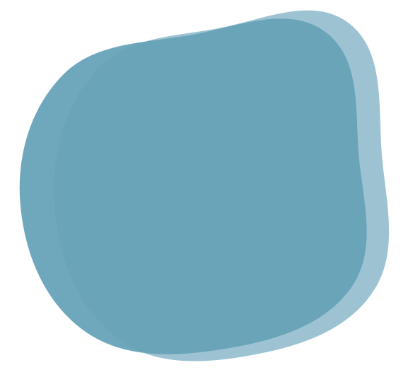
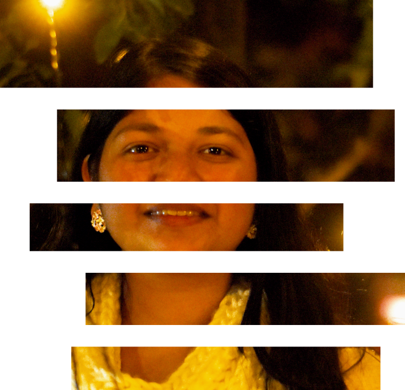

### Hi there 👋

<!--
**enraiha0307/enraiha0307** is a ✨ _special_ ✨ repository because its `README.md` (this file) appears on your GitHub profile.

Here are some ideas to get you started:

- 🔭 I’m currently working on ...
- 🌱 I’m currently learning ...
- 👯 I’m looking to collaborate on ...
- 🤔 I’m looking for help with ...
- 💬 Ask me about ...
- 📫 How to reach me: ...
- 😄 Pronouns: ...
- ⚡ Fun fact:
-->

<!DOCTYPE html>
<!--[if gt IE 8]><!--> <html class="no-js" data-theme="light"> <!--<![endif]-->
    <head>
        <meta charset="utf-8">
        <meta http-equiv="X-UA-Compatible" content="IE=edge">
        <title>Akanksha Gahalot|UI/UX Designer</title>
        <meta name="description" content="">
        <meta name="viewport" content="width=device-width, initial-scale=1"> 
         
        <link rel="stylesheet" href="style.css">
       
    </head>
    
                    

                    

                    

                        <h1>Hi, I am Akanksha Gahalot</h1>
                        
UI/UX Designer

                    

                    
 
                    

                        

                        <a class="social_copy" href="https://github.com/enraiha0307"><box-icon name='github' type='logo' animation='tada' color='#c4c4c4' ></box-icon></a>
                        

                        

                            <a class="social_copy" href="mailto:akankshagahlot0307@gmail.com"> <box-icon name='envelope' animation='tada' color='#c4c4c4' ></box-icon></a>
                        

                        

                        <a class="social_copy" href="https://www.linkedin.com/in/akanksha-gahalot-0307/"><box-icon name='linkedin' type='logo' animation='tada' color='#c4c4c4' ></box-icon></a>
                    

                    

                        <a class="social_copy" href="https://www.instagram.com/akku_0307/?hl=en"><box-icon name='instagram' type='logo' animation='tada' color='#c4c4c4' ></box-icon></a>
                    

                    

                        <a class="social_copy" href="https://www.pinterest.ca/enraihakazenost/boards/"><box-icon name='pinterest' type='logo' animation='tada' color='#c4c4c4' ></box-icon></a>
                    

                    

                        <a class="social_copy" href="https://dribbble.com/Akku_0307"><box-icon name='dribbble' type='logo' animation='tada' color='#c4c4c4'  ></box-icon></a>
                    

                

                

                    

                    

                    

                    

                    

                    

                    

                    

                    

                    

                    

                    

                    

                    

                    

                    
      
                    

                    
     
                    

            </section>
            
            

                

                    
                

                

                    
                    

                        <h2>About me</h2>
                        
Hi! I am Akanksha Gahalot. I am a Computer Science & Engineering   student at NIT Hamirpur.

                        I love designing websites and apps.  But I can code too!
                    

                   
                

          
            

            

                

                    
                    

                        <h2>PROJECTS</h2>
                                
I have been doing projects and participating in hackathons since 2017.
                                

                                
                    

                

                

                    
                

               
          
            

            
        

       
       

        
        
       
    </body>
</html>
I am Akanksha and I love building Websites. 
Learning different skills during quarantine. 
I have an Artistic Side too.Go checkout on Dribble.
  
  
